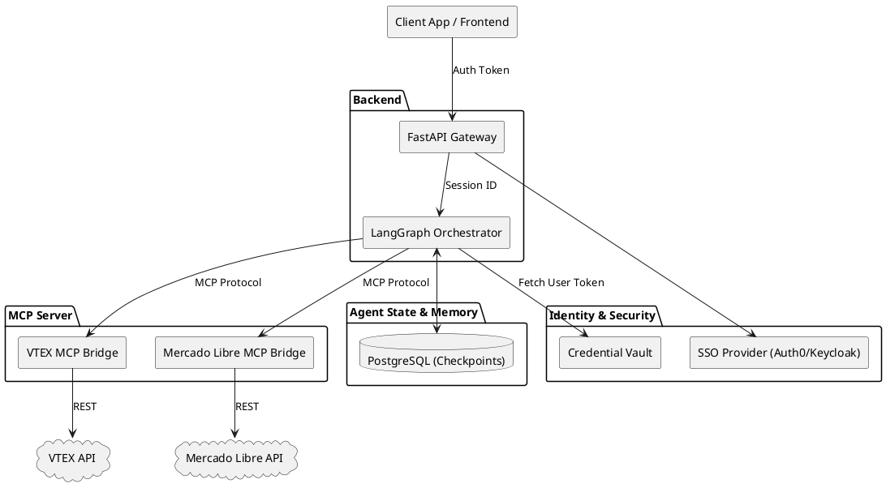

# Acomm (Agent Commerce)

Acomm is a modern shopping infrastructure designed specifically for AI agents. This repository contains the complete stack for the Acomm platform, separated into bounded contexts and decoupled services.

## Architecture



The project is structured as a monorepo with three main components:

1. **[`mcp-server`](./mcp-server/)**: A Model Context Protocol (MCP) server written in Go. It manages the core e-commerce catalog (products, categories, brands, orders) and exposes these capabilities as tools that an AI agent can natively consume.
2. **[`backend`](./backend/)**: The agentic "brain" built with Python, FastAPI, and LangGraph. It acts as the routing and reasoning layer, connecting to the MCP server to fulfill user requests and maintaining conversation state in PostgreSQL.
3. **[`frontend`](./frontend/)**: A Streamlit-based web interface for users to interact with the Acomm purchasing agent.

## Quickstart

The easiest way to run the entire stack locally is using Docker Compose. Make sure you have Docker installed and your `.env` file configured.

```bash
# Start all services (frontend, backend, mcp-server, and databases)
docker compose up --build
```

Once the containers are running, you can access:
- **Frontend UI**: http://localhost:8501
- **Backend API**: http://localhost:8000
- **MCP Server**: http://localhost:8080


## Development

For detailed development instructions, please refer to the README files in each respective project directory:
- [MCP Server README](./mcp-server/README.md)
- [Backend README](./backend/README.md)
- [Frontend README](./frontend/README.md)
